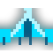

<p id="title" align="center">
  <a href="#title">
    
    <h1 align="center">Space Invaders</h1>
  </a>
</p>

<p align="center">
  <a aria-label="Made By Aristofany" href="https://github.com/aristofany-herderson/">
    
  </a>
  <a aria-label="License" href="./LICENSE">
    
  </a>
  <a aria-label="Enjoy My Repositories" href="https://github.com/aristofany-herderson?tab=repositories">
    
  </a>
</p>

<p align="center">
  👾 A modern Space Invaders clone built with C++ and SFML.
</p>

<br/>

# 🧪 Technologies

This project was developed using:

- C++
- SFML 3
- Visual Studio 2026

<br/>

# 📂 Project Structure

```
assets/
    fonts/
    sounds/
    sprites/
Background.cpp
Bullet.cpp
Enemy.cpp
Game.cpp
Particle.cpp
Player.cpp
Shield.cpp
SoundManager.cpp
Spritegen.cpp
main.cpp
```

The project follows a classic object-oriented architecture where each game entity is encapsulated into its own class.

<br/>

# 🧑🏻‍💻 Getting Started

Clone the repository:

```bash
git clone https://github.com/aristofany-herderson/space-invaders.git

cd space-invaders
```

Install .dll **SFML 3** files and configure workspace correctly.

Open the solution in **Visual Studio 2026**.

Then build and run the project.

<br/>

# 🎮 Project

A classic **Space Invaders** remake featuring modern graphics, sound effects and particle effects while preserving the original arcade gameplay.

The player controls a spaceship and must survive successive waves of enemies while achieving the highest possible score.

<br/>

# 🚀 Features

- ✅ Multiple enemy types
- ✅ Animated explosions
- ✅ Particle effects
- ✅ Sound effects
- ✅ Background music
- ✅ UFO enemy
- ✅ Player shield system
- ✅ Multiple power-ups
- ✅ High Score saving
- ✅ Progressive difficulty
- ✅ Modern sprite rendering
- ✅ Arcade gameplay

<br/>

# 🎨 Assets

The project includes:

- Pixel-art sprites
- Sound effects
- Background music
- Custom font

All assets are stored inside the `assets/` directory.

<br/>

# 🧠 Project Architecture

The game is organized into independent modules:

- **Game** → Main game loop and state management
- **Player** → Player movement and shooting
- **Enemy** → Enemy AI and behaviors
- **Bullet** → Projectile system
- **Shield** → Shield mechanics
- **Particle** → Explosion and visual effects
- **Background** → Animated background
- **SoundManager** → Audio management
- **Spritegen** → Sprite loading and management

This modular architecture makes the project easy to maintain and extend.

<br/>

# 📸 Screenshots

```
Coming Soon
```

<br/>

# 📈 Future Improvements

- Boss fights
- New enemy formations
- More power-ups
- Difficulty modes
- Leaderboards
- Controller support
- Settings menu
- Achievements

<br/>

# 🧑🏻 Author

<p align="center">
  

  <p align="center">
    Aristofany Herderson
  </p>

  <p align="center">
    <a href="https://www.linkedin.com/in/aristofany-herderson/" target="_blank">
    
    </a>
    <a href="https://www.instagram.com/aristo.dev/" target="_blank">
    
    </a>
  </p>
</p>

<br/>

# 📜 License

This project is distributed under the MIT License.

Feel free to fork, study and improve it.

<br/>

# 👾 Arcade Never Dies

_"The only thing standing between humanity and the invaders is you."_
